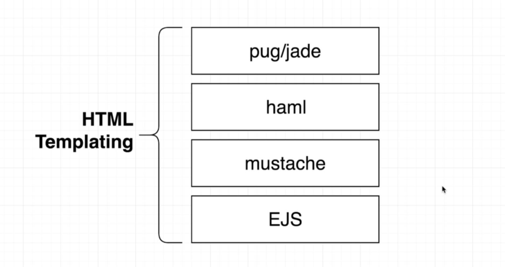

# E-Commerence App

## Approach

### Prokject setup

- Create a new project directory

- Generate a package.json file

- Install a few dependencies to help us write out project

- Create a 'start' script to run our project

---

### npm dependencies

#### express

- Helping us create a WEB server
- Library that allows us to very quickly set up a full featured Web server that cna recieve network request and respond to them

#### nodemon

- Little development tool that will automatically restart out Web server anytime our project file changes

### Timeline

1.  Browser sends HTTP header to the server
2.  Server sees request with path and method
3.  Server runs appropriate callback method
4.  THEN the browser starts transmitting information from bodt of request
5.  Browser sends a little chunk of info, waits for confirmation

         Browser sends a little chunk of info, waits for confirmation

            Browser sends a little chunk of info, waits for confirmation

               ........

6.  All chunk sent! Request complete!

---

### Middelware in Express

- Function that does some pre-processing on the 'req', 'res' object
- Primary means of code reuse in Express

---

### Data Modeling Approach

Repository Approach

- A single class (repository) is responsible for data access.
- All records are stored and used as plain JS objects

Active Record Approach

- Every record is an instance of a 'model' class that has methods to save, update, delete this record.

### User Repository

|  Method  | Input Arguments | Return Value |                          Description                          |
| :------: | :-------------: | :----------: | :-----------------------------------------------------------: |
|  getAll  |        -        |    [user]    |                     Gets a list of users                      |
|  getOne  |       id        |     user     |               Finds the user with the given id                |
| getOneBy |     filters     |     user     |             Finds one user with the given filters             |
|  create  |   attributes    |     null     |           Creates a user with the given attributes            |
|  update  | id, attributes  |     null     | Updates the user with the given id using the given attributes |
|  delete  |       id        |     null     |               Delete the user with the given id               |
| randomID |        -        |      ID      |                     Generates a random id                     |
| writeAll |        -        |     null     |             Writes all users to a users.json file             |

- Products Repository

## Rather than exporting the entire class of users repository instead export an instance

## Cookie based Athentication

- for every domain you visit , you are going to have a different set of cookies

## Hashing Algorithm ( sha256 online hashing password)

`Password` => `Hasing algorithm` => `encrypted value (dsfjdskdsl76da76s76easd76s)`

- We stored the `hashed output` instead of actuall `Password`

- when user looging in comaper `hashed output` to `hashed input`

### Rainbow table attack

- A rainbow table attack is a password cracking method that uses a special table (a “rainbow table”) to crack the password hashes in a database. ... After the user enters their password to login, it is converted to hashes, and the result is compared with the stored hashes on the server to look for a match.

### Salting + Hashing Password

- Password Salting is a technique used to help protect passwords stored in a database from being reverse-engineered by hackers who might breach the environment. Password salting involves adding a string of between 32 or more characters to a password and then hashing it.

## Project Structure

### Project Directories

<figure>
    
    <caption>ref : Udemy Colt Steele JS Bootcamp</caption>
</figure>

### HTML templating Libraries

<figure>
    
    <caption>ref : Udemy Colt Steele JS Bootcamp</caption>
</figure>

---

### Prodicts Repository

|  Method  | Input Arguments | Return Value |                           Description                            |
| :------: | :-------------: | :----------: | :--------------------------------------------------------------: |
|  getAll  |        -        |  [product]   |                     Gets a list of products                      |
|  getOne  |       id        |   product    |               Finds the product with the given id                |
| getOneBy |     filters     |   product    |             Finds one product with the given filters             |
|  create  |   attributes    |     null     |           Creates a product with the given attributes            |
|  update  | id, attributes  |     null     | Updates the product with the given id using the given attributes |
|  delete  |       id        |     null     |               Delete the product with the given id               |
| randomID |        -        |      ID      |                      Generates a random id                       |
| writeAll |    [product]    |     null     |             Writes all users to a products.json file             |

---

## Uploading Images

### 4 different methods

#### Co-Located Disk (bad Approcahes )

- not a long term solution

- It doesnt work in the long term if you ever expect to scale or grow your application

#### Database ( not good Approach )

- cost of doing this is expensive

#### Stram Through to Datastroe ( OK Approach)

- Outside Data Store for Files

- ex ) Amazon S3, Digital Ocean Spaces, google Cloud Storage....

#### <strong>Presigned URL ( Best Approcah // Complecate)<strong>

- It doesnt send it to the server
- if user wants to upload images server send it back over to the browser and called `Presigned URL`
- Directly over to the `Outside Data Storage`
- Not involving server at all

---

## Shopping cart

---

### Problem #1

- How do we tie a cart to a person who will never be logged in ?

  <figure>
  
  <caption>ref
  </figure>

  - Add product with ID 123 to my cart
  - Logic to store all the different active shopping carts + products in them
  - Product added to cart. By the way, please store Cart ID 987 in your Cookie, so i know which cart is yours

---

### Problem #2

- Even if we can identify who is trying to add an item to a cart, how do we tie a product to a cart ?

#### 3 Solutions

- Bad Approcach 1
  <figure>
  
  <caption>ref : Udemy Colt Steele JS Bootcamp</caption>
  </figure>

  - Any time we want to ask about what products belong to what users we have to iterate through out entire list of products

  - Polluting the definition of exaxtly what a product is ( which means it contains too many informations)

- Bad Approach 2
  <figure>
  
  <caption>ref : Udemy Colt Steele JS Bootcamp</caption>
  </figure>

  - create new repository
  - we are basically copying products definition and storing it inside a carts repository
  - if admin updates details of product it might not updates cart repository detail at the same time ( expensive operation)

- Good Approach
  <figure>
   
   <caption>ref : Udemy Colt Steele JS Bootcamp</caption>
   </figure>

  - Instead of storing the entire product inside this Carts Repository we are going to instead only stroe the id of the product
  - we can easily make updates
