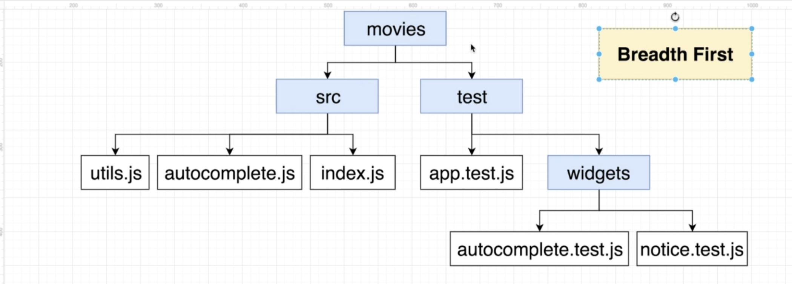

# Goals of Testing

- Automate the process of ensuring that our app works as we expect
- Keep us from having to manually click around the app to find bugs
- Make sure the app still works as expected even after we change something

---

### Simple Steps

1.  Write a tiny node project
2.  Figure out how to test it without any outside testing library
3.  Test it using a testing lib
4.  Take a look at a previous project we built in this course
5.  Test it using a testing lib
6.  Write out own testing framework that will work in about 80% of all projects

### Using node modue `assert`

- assert.strictEqual(actual, expected[, message])
- assert.deepStrictEqual(actual, expected[, message])

### Mocha JS

- change `test` to `it`
- otherwise all the same codes
- make mocha to work in the browser

##  

# Building a Testing Framework From Scratch

## Testing Framework Requirements

- Must be a Node-vased CLI framework
- Must be able to test browser-based JS Apps (important)
- Must require very, very little setup
- Must be able to test a whole application, not just one little widget
- CLI must have a `watch mode` so we don't have to keep restarting it over and over
- CLI must automatically find and run all files in our project that have a name of `\*\*\*.test.js` by convention

## Implementation Plan

- File Collection
- Test enviroment setup
- Test file execution
- Report results

### File collection

- Find all files ending in ".test.js" recursively through a folder
  - which means every file we are searching has to have a file ending in'.test.js'
- Store a reference to each file we find
- After getting a full list of the test files, execute them one by one

### Data structure we are using to find the test files

<figure>

<caption>Breath First</caption>
</figure>

- This always starts off from the Parent nodes
- add children node to array
- find childrens from each node
- add them into the same array
- iterates over till there is no more child nodes
